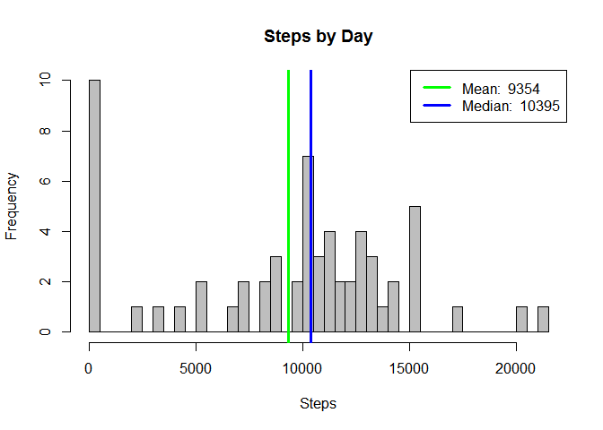
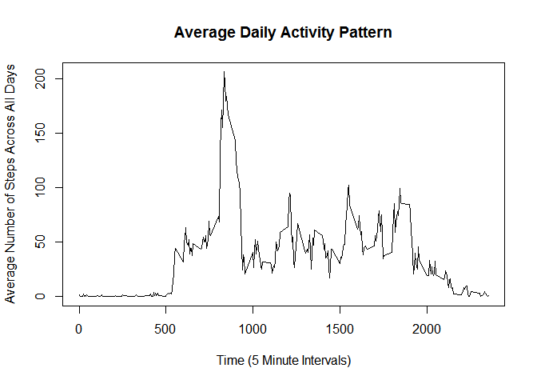
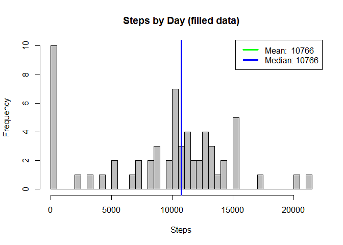
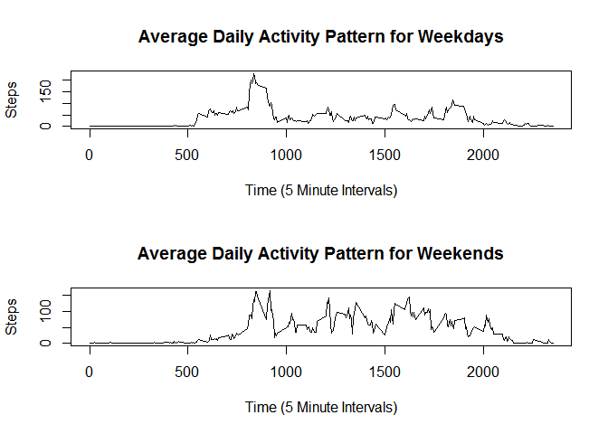

# Reproducible Research: Peer Assessment 1


## Loading and preprocessing the data


The variables included in this dataset are:

1. **steps**: Number of steps taking in a 5-minute interval (missing values are coded as NA ) 
2. **date**: The date on which the measurement was taken in YYYY-MM-DD format 
3. **interval**: Identifier for the 5-minute interval in which measurement was taken

Read in the data and examine the structure:


```r
data = read.csv('activity.csv', header = T)
head(data)
```

```
##   steps       date interval
## 1    NA 2012-10-01        0
## 2    NA 2012-10-01        5
## 3    NA 2012-10-01       10
## 4    NA 2012-10-01       15
## 5    NA 2012-10-01       20
## 6    NA 2012-10-01       25
```

```r
str(data)
```

```
## 'data.frame':	17568 obs. of  3 variables:
##  $ steps   : int  NA NA NA NA NA NA NA NA NA NA ...
##  $ date    : Factor w/ 61 levels "2012-10-01","2012-10-02",..: 1 1 1 1 1 1 1 1 1 1 ...
##  $ interval: int  0 5 10 15 20 25 30 35 40 45 ...
```

## What is mean total number of steps taken per day?

First sum the number of steps per day:


```r
stepsByDay <- tapply(data$steps, data$date, sum, na.rm=T)
```

Now create a histogram that displays the mean and median steps per day:


```r
hist(stepsByDay,breaks=length(stepsByDay),main='Steps by Day',xlab = 'Steps',col='grey')

# calculate the mean and median number of steps per day
meanSteps <- mean(stepsByDay)
medianSteps <- median(stepsByDay)
        
# mark the mean and median values on the histogram
abline(v=meanSteps, lwd = 3, col = 'green')
abline(v=medianSteps, lwd = 3, col = 'blue')
        
# create legend that displays the mean and median values
legend('topright', lty = 1, lwd = 3, col = c('green','blue'),legend = 
           c(paste('Mean: ', round(meanSteps)), paste('Median: ', medianSteps)))
```



## What is the average daily activity pattern?

First average the data by time interval:


```r
stepsByInt <- tapply(data$steps, data$interval, mean, na.rm=T)
head(stepsByInt)
```

```
##         0         5        10        15        20        25 
## 1.7169811 0.3396226 0.1320755 0.1509434 0.0754717 2.0943396
```

Now create a time series plot of average number of steps taken by time interval:


```r
plot(unlist(labels(stepsByInt)),stepsByInt, type='l',main='Average Daily Activity Pattern',xlab='Time (5 Minute Intervals)', ylab='Average Number of Steps Across All Days')
```



Finally, calculate the 5-minute time interval which averages the most number of steps.


```r
# calculates the max number of steps and the interval where it occurs
maxSteps <- max(stepsByInt)
maxSteps
```

```
## [1] 206.1698
```

```r
maxInt <- labels(stepsByInt[(which(stepsByInt==maxSteps))])
maxInt
```

```
## [1] "835"
```

## Imputing missing values

First, calculate the number of missing values in the dataset.


```r
numNA <- sum(is.na(data$steps))
numNA
```

```
## [1] 2304
```

Next, fill in missing values with the average for that time period.


```r
# make a copy of data
fdata <- data
head(fdata)
```

```
##   steps       date interval
## 1    NA 2012-10-01        0
## 2    NA 2012-10-01        5
## 3    NA 2012-10-01       10
## 4    NA 2012-10-01       15
## 5    NA 2012-10-01       20
## 6    NA 2012-10-01       25
```

```r
# function that replaces NA with the average steps for that interval
replaceNa = function(steps, int){
    if (is.na(steps)){
        fSteps <- stepsByInt[as.character(int)]
    }
    else {
        fSteps <- steps
    }
    fSteps
}
lengthSteps<-length(fdata$steps)

for (i in (1:lengthSteps)){
    fdata$steps[i] <- replaceNa(data[i,1],fdata[i,3])
}

head(fdata)
```

```
##       steps       date interval
## 1 1.7169811 2012-10-01        0
## 2 0.3396226 2012-10-01        5
## 3 0.1320755 2012-10-01       10
## 4 0.1509434 2012-10-01       15
## 5 0.0754717 2012-10-01       20
## 6 2.0943396 2012-10-01       25
```

Now sum the number of steps per day for the filled in data:


```r
fstepsByDay <- tapply(fdata$steps, data$date, sum, na.rm=T)
```

Now create a histogram that displays the mean and median steps per day:


```r
hist(stepsByDay,breaks=length(fstepsByDay),main='Steps by Day (filled data)',xlab = 'Steps',col='grey')

# calculate the mean and median number of steps per day
fmeanSteps <- mean(fstepsByDay)
fmedianSteps <- median(fstepsByDay)
        
# mark the mean and median values on the histogram
abline(v=fmeanSteps, lwd = 3, col = 'green')
abline(v=fmedianSteps, lwd = 3, col = 'blue')
        
# create legend that displays the mean and median values
legend('topright', lty = 1, lwd = 3, col = c('green','blue'),legend = 
           c(paste('Mean: ', round(fmeanSteps)), paste('Median:',round(fmedianSteps))))
```



Finally calculate the differences between the mean and median of the original and filled data


```r
meanDif <- fmeanSteps-meanSteps
meanDif
```

```
## [1] 1411.959
```

```r
medianDif <- fmedianSteps-medianSteps
medianDif
```

```
## [1] 371.1887
```

So, by filling in the missing values with the average for that time interval raised the mean by 1411.959 and the median by 371.1887.

## Are there differences in activity patterns between weekdays and weekends?

First create a factor column for weekday on the filled data


```r
#formats the date column as dates
data$date <- as.POSIXlt(data$date)

data$weekday <- weekdays(data$date)

weekDay= function(x){
    lengthx <- length(x)
    y <- character(length=lengthx)
    for (i in (1:lengthx)){
        if (x[i]=="Sunday"){
            y[i]<-"weekend"
        }
        else if (x[i]=="Saturday"){
            y[i]<-"weekend"
        }
        else{
            y[i]<-"weekday"
        }
        y[i]
    }
    return (y)
}

fdata$weekday<-weekDay(data$weekday)
```

Next create a plot of average steps taken on weekends and on weekdays by time interval.


```r
fdataWD <- fdata[fdata$weekday=="weekday",,]
head(fdataWD)
```

```
##       steps       date interval weekday
## 1 1.7169811 2012-10-01        0 weekday
## 2 0.3396226 2012-10-01        5 weekday
## 3 0.1320755 2012-10-01       10 weekday
## 4 0.1509434 2012-10-01       15 weekday
## 5 0.0754717 2012-10-01       20 weekday
## 6 2.0943396 2012-10-01       25 weekday
```

```r
stepsByWeekday <- tapply(fdataWD$steps, fdataWD$interval, mean, na.rm=T)
head(stepsByWeekday)
```

```
##          0          5         10         15         20         25 
## 2.25115304 0.44528302 0.17316562 0.19790356 0.09895178 1.59035639
```

```r
fdataWE <- fdata[fdata$weekday=="weekend",,]
head(fdataWE)
```

```
##      steps       date interval weekday
## 1441     0 2012-10-06        0 weekend
## 1442     0 2012-10-06        5 weekend
## 1443     0 2012-10-06       10 weekend
## 1444     0 2012-10-06       15 weekend
## 1445     0 2012-10-06       20 weekend
## 1446     0 2012-10-06       25 weekend
```

```r
stepsByWeekend <- tapply(fdataWE$steps, fdataWE$interval, mean, na.rm=T)
head(stepsByWeekend)
```

```
##           0           5          10          15          20          25 
## 0.214622642 0.042452830 0.016509434 0.018867925 0.009433962 3.511792453
```

```r
par(mfcol=c(2,1))
plot(unlist(labels(stepsByWeekday)),stepsByWeekday, type='l',main='Average Daily Activity Pattern for Weekdays',xlab='Time (5 Minute Intervals)', ylab='Steps')
plot(unlist(labels(stepsByWeekend)),stepsByWeekend, type='l',main='Average Daily Activity Pattern for Weekends',xlab='Time (5 Minute Intervals)', ylab='Steps')
```



```r
dev.off()
```

```
## null device 
##           1
```
